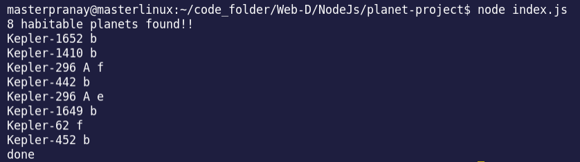

# Habitable Planets 🪐
This Project is from the NodeJs Udemy course. We are parsing a CSV file, based on the keplar rocket data.
Our goal to find the best suited habitable planets. 😜

## Tools Used ⚙️
- NodeJs
    - Create File Stream API
- Parse-CSV library
- Kepler data ( in csv format )

## Author : [Pranay Raj](https://linkedin.com/in/masterpranay)